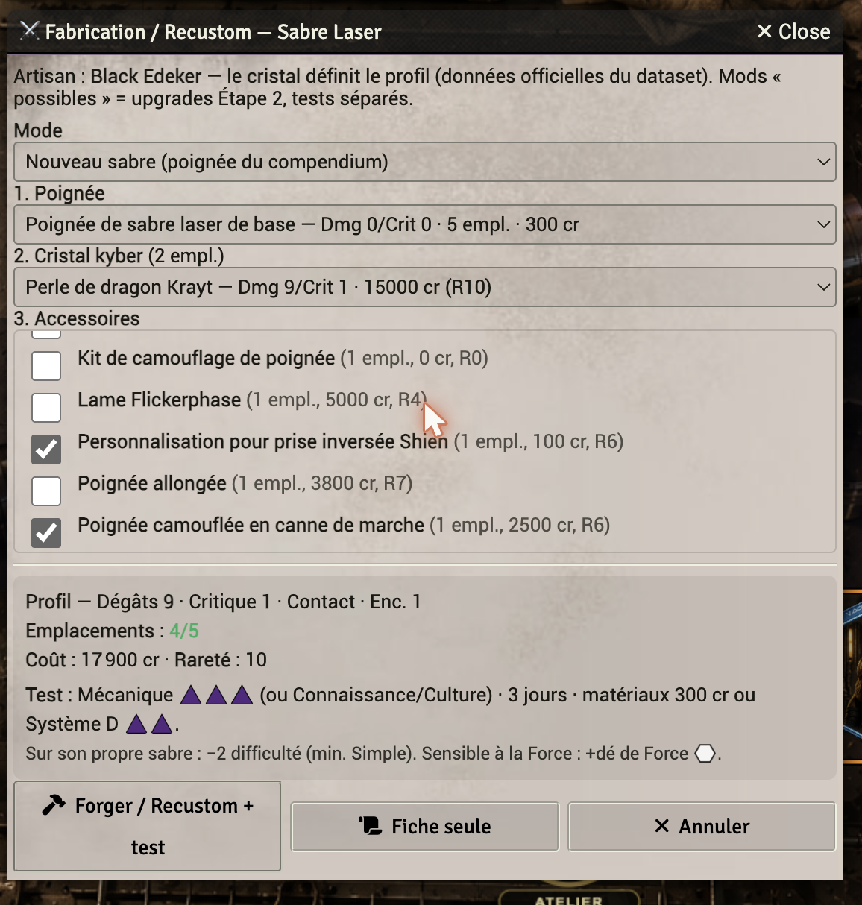
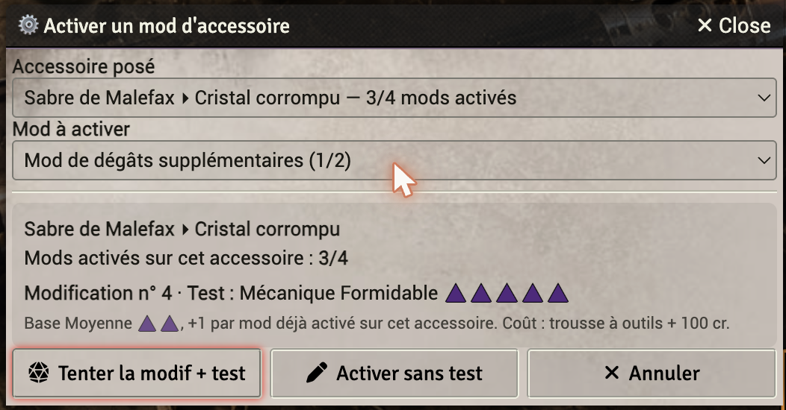
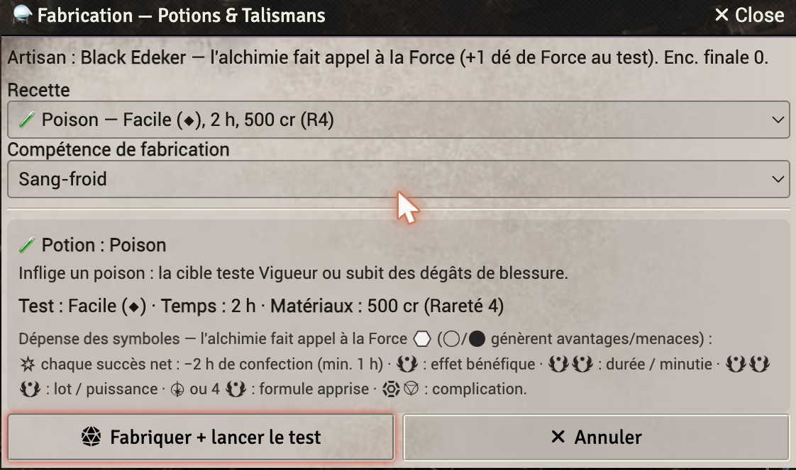

# ⚒️ Crafting Workshops — Star Wars FFG

Compendium-driven **crafting & modding** for the [Star Wars FFG](https://foundryvtt.com/packages/starwarsffg)
system on Foundry VTT (v12/v13). Forge lightsabers, install & upgrade attachments on weapons and armor,
and brew potions & talismans — the profile is **computed natively by the system**, nothing is hardcoded.
Fully bilingual **English / French** (content installs in your world's language).

*[Version française plus bas](#-version-française)*

---

## ✨ Highlights

- **Lightsaber forge** — a saber is a real **hilt + crystal + accessories**. The crystal sets Damage/Critical,
  each part stays a real attachment and remains **upgradable** afterwards. New or recustom, roll-gated.
- **Weapon & armor tuning** — install attachments picked **dynamically from your compendium** (not a fixed list),
  with hard-point budget, live profile preview and a Mechanics check.
- **Mod upgrades (Step 2)** — activate an attachment's mods one at a time; difficulty follows the **book rule**
  (Average ◆◆, **+1 per mod already activated** on that attachment). A numeric mod actually changes the profile.
- **Potions & Talismans** — Force-alchemy recipes with contextual advantage/triumph spending.
- **One Workshop hub** — pick **who you craft for** (your character or, as GM, any actor including NPCs), then route.
- **Immersive scenes** with clickable Monk's Active Tiles, plus a bilingual **rules journal** and a GM
  **repair/enrich** tool for existing gear.

## 📸 Screenshots

**Lightsaber forge — hilt + crystal + accessories, native profile**



**Mod upgrade (Step 2) — book-accurate escalating difficulty**



**Potions & Talismans — recipes with symbol spending**



## 📦 Install

Install / update via the manifest URL:

```
https://github.com/wanoo/swffg-workshops/releases/latest/download/module.json
```

Then enable it in your world. On first load as GM, accept the install prompt (or *Configure Settings →
swffg-workshops → Install*): it creates the crafting macros, the **⚒️ Atelier** hub macro, the rules journal
and the two workshop scenes **in your world's language**. Re-runnable at any time (existing content is kept).

## ✅ Requirements

- **System:** `starwarsffg`.
- **OggDude compendium in your world** — the workshops read weapons, attachments and mods from your
  `world.oggdude*` packs (import the OggDude dataset with the system's importer). Without it, the lists are empty.
- **Optional:** *Monk's Active Tile Triggers* (clickable scene tiles), *FXMaster* (ambience).

## 🔧 How to upgrade a mod

In game: **⚒️ Atelier → Weapon / Armor → Activate a mod** (or the **Tuning** macro directly). Pick the installed
attachment and the mod, roll the Mechanics check. The counter increments, the difficulty escalates
(Average +1 per already-activated mod), and a numeric mod is applied to the item's profile.

## 🐞 Found a bug?

The module offers to **open a pre-filled GitHub issue** (with module/Foundry/system versions and the error)
whenever it hits an unexpected error — just click *Open a GitHub issue*. Or file one at
[github.com/wanoo/swffg-workshops/issues](https://github.com/wanoo/swffg-workshops/issues).

## Companion

[Sabacc — Star Wars FFG](https://github.com/wanoo/swffg-sabacc): two full Sabacc card games for the same system.

---

# 🇫🇷 Version française

Atelier de **fabrication & modification** piloté par le compendium, pour le système
[Star Wars FFG](https://foundryvtt.com/packages/starwarsffg) sur Foundry VTT (v12/v13). Forge des sabres laser,
pose & améliore des accessoires sur armes et armures, fabrique potions & talismans — le profil est
**calculé nativement par le système**, rien n'est codé en dur. Entièrement bilingue **français / anglais**.

## ✨ Points forts

- **Forge de sabre** — un sabre = **poignée + cristal + accessoires** réels. Le cristal fixe Dégâts/Critique,
  chaque partie reste **améliorable** ensuite. Neuf ou recustom, conditionné par un jet.
- **Réglage arme & armure** — pose d'accessoires listés **dynamiquement depuis ton compendium**, avec budget
  d'emplacements, aperçu du profil et jet de Mécanique.
- **Améliorations de mod (Étape 2)** — active les mods d'un accessoire un par un ; difficulté selon la
  **règle du livre** (Moyenne ◆◆, **+1 par mod déjà activé**). Un mod chiffré modifie vraiment le profil.
- **Potions & Talismans** — recettes d'alchimie de la Force avec dépense contextuelle des avantages/triomphes.
- **Un hub Atelier** — choisis **pour qui tu fabriques** (ton perso ou, en MJ, n'importe quel acteur, PNJ compris).
- **Scènes immersives** à tuiles cliquables (Monk's Active Tiles), **journal de règles** bilingue et outil MJ
  de **réparation/enrichissement** des équipements existants.

## 📦 Installation

URL de manifest (installation / mise à jour) :

```
https://github.com/wanoo/swffg-workshops/releases/latest/download/module.json
```

Active le module dans ton monde. Au premier lancement en MJ, accepte l'installation (ou *Configuration des
options → swffg-workshops → Installer*) : macros, hub **⚒️ Atelier**, journal de règles et les 2 scènes d'atelier
sont créés **dans la langue du monde**. Réinstallable à tout moment (le contenu existant est conservé).

## ✅ Prérequis

- **Système** : `starwarsffg`.
- **Compendium OggDude dans ton monde** — les ateliers lisent armes, accessoires et mods dans tes packs
  `world.oggdude*` (importe le dataset OggDude avec l'importateur du système). Sans lui, les listes sont vides.
- **Optionnel** : *Monk's Active Tile Triggers* (tuiles cliquables), *FXMaster* (ambiance).

## 🐞 Un bug ?

En cas d'erreur inattendue, le module propose d'**ouvrir un ticket GitHub pré-rempli** (versions module/Foundry/
système + l'erreur) — clique *Ouvrir une issue*. Ou dépose-en un sur
[github.com/wanoo/swffg-workshops/issues](https://github.com/wanoo/swffg-workshops/issues).

## Module compagnon

[Sabacc — Star Wars FFG](https://github.com/wanoo/swffg-sabacc) : deux jeux de Sabacc complets pour le même système.
